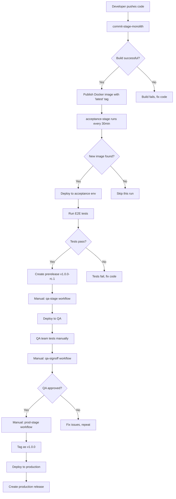

# # Complete CI/CD Pipeline Setup Guide
## From Zero to Production with GitHub Actions, Docker, and AWS

---

## Table of Contents

1. [Project Overview](#project-overview)
2. [Prerequisites](#prerequisites)
3. [Phase 1: GitHub Repository Setup](#phase-1-github-repository-setup)
4. [Phase 2: Project Structure & Source Code](#phase-2-project-structure--source-code)
5. [Phase 3: GitHub Container Registry (GHCR) Setup](#phase-3-github-container-registry-ghcr-setup)
6. [Phase 4: AWS Infrastructure Setup](#phase-4-aws-infrastructure-setup)
7. [Phase 5: GitHub Actions Configuration](#phase-5-github-actions-configuration)
8. [Phase 6: Testing the Complete Pipeline](#phase-6-testing-the-complete-pipeline)
9. [Phase 7: Understanding the Workflow](#phase-7-understanding-the-workflow)
10. [Troubleshooting](#troubleshooting)

---

## Project Overview

This guide will help you build a complete CI/CD pipeline for a Node.js/TypeScript application with:

- **Automated Build**: Code push triggers automatic Docker image creation
- **Automated Testing**: Acceptance tests run every 30 minutes on new images
- **QA Environment**: Manual deployment to QA with sign-off process
- **Production Deployment**: Controlled release to production
- **Version Management**: Semantic versioning with prerelease and production tags

**Pipeline Flow:**
```
Developer Push → Build & Publish → Acceptance Tests → QA Deploy → QA Sign-off → Production Deploy
```

---

## Prerequisites

### What You Need:
- ✅ GitHub Account (free tier works)
- ✅ AWS Account with billing enabled
- ✅ Basic knowledge of Git commands
- ✅ SSH key for GitHub (we'll set this up)
- ✅ Local machine with:
  - Git installed
  - Node.js 20+ installed
  - Text editor (VS Code recommended)
  - Terminal/Command Line access

### Estimated Costs:
- **GitHub**: Free (GHCR includes 500MB free storage)
- **AWS**: ~$5-10/month for t3.micro instances
- **Total**: ~$10/month maximum

---

## Phase 1: GitHub Repository Setup

### Step 1.1: Create New Repository

1. Go to https://github.com
2. Click the **"+"** icon → **"New repository"**
3. Fill in details:
   - **Repository name**: `cicd-demo-project`
   - **Description**: `Complete CI/CD pipeline demo with GitHub Actions`
   - **Visibility**: Public (for free GHCR) or Private (if you have GitHub Pro)
   - ✅ Initialize with README
   - **Add .gitignore**: Node
   - **License**: MIT
4. Click **"Create repository"**

### Step 1.2: Clone Repository Locally

```bash
# Open terminal and navigate to your workspace
cd ~/workspace

# Clone the repository (replace YOUR_USERNAME)
git clone https://github.com/YOUR_USERNAME/cicd-demo-project.git

# Navigate into the project
cd cicd-demo-project
```

### Step 1.3: Configure Git

```bash
# Set your identity
git config user.name "Your Name"
git config user.email "your.email@example.com"

# Verify settings
git config --list
```

---

## Phase 2: Project Structure & Source Code

### Step 2.1: Create Project Structure

```bash
# Create all directories at once
mkdir -p monolith/src
mkdir -p monolith/test
mkdir -p system-test/test/e2e-tests
mkdir -p .github/workflows
mkdir -p .github/actions/deploy-docker-images
```

Your structure should look like:
```
cicd-demo-project/
├── .github/
│   ├── workflows/           # GitHub Actions workflows
│   └── actions/
│       └── deploy-docker-images/   # Reusable deployment action
├── monolith/                # Main application
│   ├── src/
│   ├── test/
│   ├── package.json
│   ├── tsconfig.json
│   └── Dockerfile
└── system-test/             # End-to-end tests
    ├── test/
    │   └── e2e-tests/
    └── package.json
```

### Step 2.2: Create Monolith Application

#### File: `monolith/package.json`

```json
{
  "name": "monolith",
  "version": "1.0.0",
  "description": "Demo monolith application",
  "main": "dist/index.js",
  "scripts": {
    "build": "tsc",
    "start": "node dist/index.js",
    "dev": "ts-node src/index.ts",
    "test": "jest"
  },
  "dependencies": {
    "express": "^4.18.2"
  },
  "devDependencies": {
    "@types/express": "^4.17.21",
    "@types/node": "^20.10.0",
    "typescript": "^5.3.3",
    "ts-node": "^10.9.2",
    "jest": "^29.7.0",
    "@types/jest": "^29.5.11"
  }
}
```

#### File: `monolith/tsconfig.json`

```json
{
  "compilerOptions": {
    "target": "ES2022",
    "module": "commonjs",
    "lib": ["ES2022"],
    "outDir": "./dist",
    "rootDir": "./src",
    "strict": true,
    "esModuleInterop": true,
    "skipLibCheck": true,
    "forceConsistentCasingInFileNames": true,
    "resolveJsonModule": true,
    "declaration": true,
    "declarationMap": true,
    "sourceMap": true
  },
  "include": ["src/**/*"],
  "exclude": ["node_modules", "dist", "test"]
}
```

#### File: `monolith/src/index.ts`

```typescript
import express, { Request, Response } from 'express';

const app = express();
const PORT = process.env.PORT || 3000;

// Middleware
app.use(express.json());

// Health check endpoint
app.get('/health', (req: Request, res: Response) => {
  res.status(200).json({ 
    status: 'healthy',
    timestamp: new Date().toISOString(),
    version: process.env.APP_VERSION || '1.0.0'
  });
});

// Root endpoint
app.get('/', (req: Request, res: Response) => {
  res.status(200).json({ 
    message: 'Welcome to the Monolith API',
    endpoints: {
      health: '/health',
      users: '/api/users'
    }
  });
});

// Example API endpoint
app.get('/api/users', (req: Request, res: Response) => {
  const users = [
    { id: 1, name: 'John Doe', email: 'john@example.com' },
    { id: 2, name: 'Jane Smith', email: 'jane@example.com' }
  ];
  res.status(200).json(users);
});

// Start server
app.listen(PORT, () => {
  console.log(`🚀 Server running on port ${PORT}`);
  console.log(`📊 Health check: http://localhost:${PORT}/health`);
});

export default app;
```

#### File: `monolith/Dockerfile`

```dockerfile
# Build stage
FROM node:20-alpine AS builder

WORKDIR /app

# Copy package files
COPY package*.json ./

# Install dependencies
RUN npm ci

# Copy source code
COPY . .

# Build TypeScript
RUN npm run build

# Production stage
FROM node:20-alpine

WORKDIR /app

# Copy package files
COPY package*.json ./

# Install production dependencies only
RUN npm ci --only=production

# Copy built application from builder
COPY --from=builder /app/dist ./dist

# Expose port
EXPOSE 3000

# Set environment
ENV NODE_ENV=production

# Health check
HEALTHCHECK --interval=30s --timeout=3s --start-period=5s --retries=3 \
  CMD node -e "require('http').get('http://localhost:3000/health', (r) => {process.exit(r.statusCode === 200 ? 0 : 1)})"

# Start application
CMD ["node", "dist/index.js"]
```

#### File: `monolith/.dockerignore`

```
node_modules
dist
npm-debug.log
.git
.gitignore
README.md
test
*.test.ts
.env
.DS_Store
```

### Step 2.3: Create System Tests

#### File: `system-test/package.json`

```json
{
  "name": "system-test",
  "version": "1.0.0",
  "description": "End-to-end system tests",
  "scripts": {
    "test": "playwright test"
  },
  "devDependencies": {
    "@playwright/test": "^1.40.1",
    "@types/node": "^20.10.0"
  }
}
```

#### File: `system-test/playwright.config.ts`

```typescript
import { defineConfig } from '@playwright/test';

export default defineConfig({
  testDir: './test',
  fullyParallel: true,
  forbidOnly: !!process.env.CI,
  retries: process.env.CI ? 2 : 0,
  workers: process.env.CI ? 1 : undefined,
  reporter: 'html',
  use: {
    baseURL: process.env.BASE_URL || 'http://localhost:3000',
    trace: 'on-first-retry',
  },
});
```

#### File: `system-test/test/e2e-tests/api.spec.ts`

```typescript
import { test, expect } from '@playwright/test';

test.describe('API Tests', () => {
  test('should return health status', async ({ request }) => {
    const response = await request.get('/health');
    expect(response.ok()).toBeTruthy();
    
    const body = await response.json();
    expect(body.status).toBe('healthy');
    expect(body.timestamp).toBeTruthy();
  });

  test('should return welcome message on root', async ({ request }) => {
    const response = await request.get('/');
    expect(response.ok()).toBeTruthy();
    
    const body = await response.json();
    expect(body.message).toBe('Welcome to the Monolith API');
  });

  test('should return users list', async ({ request }) => {
    const response = await request.get('/api/users');
    expect(response.ok()).toBeTruthy();
    
    const users = await response.json();
    expect(Array.isArray(users)).toBeTruthy();
    expect(users.length).toBeGreaterThan(0);
  });
});
```

### Step 2.4: Install Dependencies Locally

```bash
# Install monolith dependencies
cd monolith
npm install
cd ..

# Install system-test dependencies
cd system-test
npm install
cd ..
```

### Step 2.5: Test Application Locally

```bash
# Build the application
cd monolith
npm run build

# Start the server (in terminal 1)
npm start

# In another terminal, test the endpoints
curl http://localhost:3000/health
curl http://localhost:3000/api/users

# Stop the server (Ctrl+C)
```

---

## Phase 3: GitHub Container Registry (GHCR) Setup

### Step 3.1: Create Personal Access Token (PAT)

1. Go to GitHub → Click your profile picture → **Settings**
2. Scroll down to **Developer settings** (bottom left)
3. Click **Personal access tokens** → **Tokens (classic)**
4. Click **Generate new token** → **Generate new token (classic)**
5. Fill in details:
   - **Note**: `GHCR Access Token`
   - **Expiration**: 90 days (or custom)
   - **Scopes**: Check these boxes:
     - ✅ `write:packages` (includes read:packages)
     - ✅ `delete:packages`
     - ✅ `repo` (full control)
6. Click **Generate token**
7. **IMPORTANT**: Copy the token immediately (starts with `ghp_`)
   - Store it securely (you won't see it again)

### Step 3.2: Add Token to Repository Secrets

1. Go to your repository: `https://github.com/YOUR_USERNAME/cicd-demo-project`
2. Click **Settings** tab
3. In left sidebar, click **Secrets and variables** → **Actions**
4. Click **New repository secret**
5. Add secret:
   - **Name**: `GITHUB_TOKEN` (already exists by default, we'll use it)
   - Note: GitHub automatically provides `GITHUB_TOKEN` for workflows
   
**Good news**: GitHub Actions automatically provides a `GITHUB_TOKEN` with package permissions, so you don't need to manually add it!

### Step 3.3: Enable Package Permissions

1. In repository **Settings** → **Actions** → **General**
2. Scroll to **Workflow permissions**
3. Select: ✅ **Read and write permissions**
4. Check: ✅ **Allow GitHub Actions to create and approve pull requests**
5. Click **Save**

---

## Phase 4: AWS Infrastructure Setup

### Step 4.1: Create AWS Account & Login

1. Go to https://aws.amazon.com
2. Sign in to your account
3. Select your region (e.g., `us-east-1`)

### Step 4.2: Create EC2 Key Pair

1. Go to **EC2 Dashboard** → **Key Pairs** (under Network & Security)
2. Click **Create key pair**
3. Settings:
   - **Name**: `cicd-demo-key`
   - **Key pair type**: RSA
   - **Private key file format**: `.pem`
4. Click **Create key pair**
5. Save the `.pem` file securely (you'll need it to SSH)

```bash
# Set correct permissions (Linux/Mac)
chmod 400 ~/Downloads/cicd-demo-key.pem
```

### Step 4.3: Create Security Groups

#### Security Group for Application Servers

1. Go to **EC2** → **Security Groups**
2. Click **Create security group**
3. Fill in:
   - **Name**: `cicd-app-sg`
   - **Description**: `Security group for application servers`
   - **VPC**: Default VPC

4. **Inbound rules** - Click **Add rule** for each:

   | Type | Protocol | Port Range | Source | Description |
   |------|----------|------------|--------|-------------|
   | SSH | TCP | 22 | My IP | SSH access |
   | Custom TCP | TCP | 3000 | 0.0.0.0/0 | Application port |
   | HTTP | TCP | 80 | 0.0.0.0/0 | HTTP |
   | HTTPS | TCP | 443 | 0.0.0.0/0 | HTTPS |

5. **Outbound rules**: Leave default (All traffic)
6. Click **Create security group**

### Step 4.4: Create EC2 Instances

We'll create 3 instances: Acceptance, QA, and Production.

#### Create Acceptance Environment Instance

1. Go to **EC2** → **Instances** → **Launch instances**
2. Settings:
   - **Name**: `acceptance-server`
   - **AMI**: Ubuntu Server 24.04 LTS (free tier eligible)
   - **Instance type**: t3.micro (or t2.micro for free tier)
   - **Key pair**: Select `cicd-demo-key`
   - **Network settings**:
     - **VPC**: Default
     - **Auto-assign public IP**: Enable
     - **Firewall**: Select existing `cicd-app-sg`
   - **Storage**: 8 GB gp3 (default)
   - **Advanced details** → **User data** (paste this script):

```bash
#!/bin/bash
# Update system
apt-get update
apt-get upgrade -y

# Install Docker
curl -fsSL https://get.docker.com -o get-docker.sh
sh get-docker.sh
usermod -aG docker ubuntu

# Install Docker Compose
curl -L "https://github.com/docker/compose/releases/latest/download/docker-compose-$(uname -s)-$(uname -m)" -o /usr/local/bin/docker-compose
chmod +x /usr/local/bin/docker-compose

# Create application directory
mkdir -p /opt/app
chown ubuntu:ubuntu /opt/app

# Enable Docker service
systemctl enable docker
systemctl start docker

echo "Setup complete!" > /var/log/user-data.log
```

3. Click **Launch instance**
4. Wait for instance to be **Running**
5. Note the **Public IPv4 address**

#### Create QA Environment Instance

Repeat the same steps but with:
- **Name**: `qa-server`
- Same user data script
- Note its Public IP

#### Create Production Environment Instance

Repeat the same steps but with:
- **Name**: `production-server`
- Same user data script
- Note its Public IP

### Step 4.5: Verify Server Setup

Wait 3-5 minutes for user data scripts to complete, then SSH into each:

```bash
# SSH into acceptance server
ssh -i ~/Downloads/cicd-demo-key.pem ubuntu@<ACCEPTANCE_PUBLIC_IP>

# Verify Docker is installed
docker --version
docker-compose --version

# Exit
exit

# Repeat for QA and Production servers
```

### Step 4.6: Add GitHub Secrets for AWS

1. Go to repository **Settings** → **Secrets and variables** → **Actions**
2. Add these secrets (click **New repository secret** for each):

| Name | Value | Description |
|------|-------|-------------|
| `AWS_ACCEPTANCE_HOST` | Acceptance server public IP | E.g., `54.123.45.67` |
| `AWS_ACCEPTANCE_USER` | `ubuntu` | SSH username |
| `AWS_ACCEPTANCE_KEY` | Contents of `.pem` file | Full private key |
| `AWS_QA_HOST` | QA server public IP | E.g., `54.123.45.68` |
| `AWS_QA_USER` | `ubuntu` | SSH username |
| `AWS_QA_KEY` | Contents of `.pem` file | Full private key |
| `AWS_PRODUCTION_HOST` | Production server public IP | E.g., `54.123.45.69` |
| `AWS_PRODUCTION_USER` | `ubuntu` | SSH username |
| `AWS_PRODUCTION_KEY` | Contents of `.pem` file | Full private key |

**To copy `.pem` file contents:**
```bash
cat ~/Downloads/cicd-demo-key.pem
# Copy the entire output including BEGIN and END lines
```

---

## Phase 5: GitHub Actions Configuration

### Step 5.1: Create Reusable Actions

#### File: `.github/actions/deploy-docker-images/action.yml`

```yaml
name: 'Deploy Docker Images'
description: 'Deploy Docker images to specified environment'

inputs:
  environment:
    description: 'Target environment (acceptance, qa, production)'
    required: true
  version:
    description: 'Version tag to deploy'
    required: true
  image-urls:
    description: 'JSON array of image URLs with digests or tags'
    required: true
  ssh-host:
    description: 'SSH host to deploy to'
    required: true
  ssh-user:
    description: 'SSH user'
    required: true
  ssh-key:
    description: 'SSH private key'
    required: true
  github-token:
    description: 'GitHub token for GHCR authentication'
    required: true

runs:
  using: "composite"
  steps:
    - name: Debug Input
      shell: bash
      run: |
        echo "=== DEBUG INFO ==="
        echo "Raw image-urls input: ${{ inputs.image-urls }}"
        echo "Environment: ${{ inputs.environment }}"
        echo "Version: ${{ inputs.version }}"
        echo "=================="

    - name: Parse Image URL
      id: parse
      shell: bash
      run: |
        set -e
        RAW_INPUT='${{ inputs.image-urls }}'
        echo "Raw input: $RAW_INPUT"
        
        # Remove brackets and quotes if it's a JSON array
        IMAGE_URL=$(echo "$RAW_INPUT" | sed 's/^\["//' | sed 's/"\]$//' | sed 's/^"//' | sed 's/"$//')
        
        echo "Parsed IMAGE_URL: $IMAGE_URL"
        
        if [ -z "$IMAGE_URL" ] || [ "$IMAGE_URL" = "null" ]; then
          echo "❌ Failed to parse image URL"
          exit 1
        fi
        
        echo "image-url=$IMAGE_URL" >> $GITHUB_OUTPUT
        echo "✅ Successfully parsed image URL"

    - name: Create Deployment Script
      shell: bash
      run: |
        cat > /tmp/deploy.sh << 'SCRIPT_END'
        #!/bin/bash
        set -e
        
        echo "=== Deployment Starting ==="
        echo "Environment: $ENVIRONMENT"
        echo "Image URL: $IMAGE_URL"
        echo "Version: $VERSION"
        echo "=========================="
        
        # Validate inputs
        if [ -z "$IMAGE_URL" ]; then
          echo "❌ IMAGE_URL is empty"
          exit 1
        fi
        
        # Login to GHCR
        echo "🔐 Logging into GHCR..."
        echo "$GITHUB_TOKEN" | docker login ghcr.io -u "$GITHUB_ACTOR" --password-stdin 2>&1 | grep -v "WARNING" || true
        
        # Pull new image
        echo "⬇️  Pulling image: $IMAGE_URL"
        docker pull "$IMAGE_URL"
        
        # Stop existing container
        echo "🛑 Stopping existing container..."
        docker stop monolith-app 2>/dev/null || true
        docker rm monolith-app 2>/dev/null || true
        
        # Run new container
        echo "▶️  Starting new container..."
        docker run -d \
          --name monolith-app \
          --restart unless-stopped \
          -p 3000:3000 \
          -e NODE_ENV=production \
          -e APP_VERSION="$VERSION" \
          "$IMAGE_URL"
        
        # Wait for application to start
        echo "⏳ Waiting for application to start..."
        sleep 10
        
        # Verify deployment with health check
        echo "🏥 Running health check..."
        MAX_ATTEMPTS=30
        ATTEMPT=0
        
        while [ $ATTEMPT -lt $MAX_ATTEMPTS ]; do
          if curl -f http://localhost:3000/health 2>/dev/null; then
            echo "✅ Health check passed!"
            echo "✅ Deployment successful!"
            
            echo ""
            echo "📊 Container status:"
            docker ps --filter name=monolith-app
            
            echo ""
            echo "🧹 Cleaning up old images..."
            docker image prune -af --filter "until=24h" 2>/dev/null || true
            
            echo ""
            echo "🎉 Deployment complete!"
            exit 0
          fi
          
          ATTEMPT=$((ATTEMPT + 1))
          echo "⏳ Waiting for health check... attempt $ATTEMPT/$MAX_ATTEMPTS"
          sleep 2
        done
        
        echo "❌ Health check failed after $MAX_ATTEMPTS attempts"
        echo "📋 Container logs:"
        docker logs monolith-app || true
        exit 1
        SCRIPT_END
        
        chmod +x /tmp/deploy.sh

    - name: Deploy to Server
      shell: bash
      run: |
        set -e
        
        SSH_HOST="${{ inputs.ssh-host }}"
        SSH_USER="${{ inputs.ssh-user }}"
        IMAGE_URL="${{ steps.parse.outputs.image-url }}"
        VERSION="${{ inputs.version }}"
        ENVIRONMENT="${{ inputs.environment }}"
        
        echo "🚀 Deploying to $ENVIRONMENT environment"
        echo "📦 Host: $SSH_HOST"
        echo "👤 User: $SSH_USER"
        echo "🐳 Image: $IMAGE_URL"
        echo "🏷️  Version: $VERSION"
        
        # Validate IMAGE_URL again
        if [ -z "$IMAGE_URL" ] || [ "$IMAGE_URL" = "null" ]; then
          echo "❌ Error: IMAGE_URL is empty or null after parsing"
          echo "Original input was: ${{ inputs.image-urls }}"
          exit 1
        fi
        
        # Create SSH key file
        mkdir -p ~/.ssh
        echo "${{ inputs.ssh-key }}" > ~/.ssh/deploy_key
        chmod 600 ~/.ssh/deploy_key
        
        # Add host to known_hosts
        ssh-keyscan -H "$SSH_HOST" >> ~/.ssh/known_hosts 2>/dev/null || true
        
        # Copy deployment script to server
        echo "📤 Copying deployment script to server..."
        scp -i ~/.ssh/deploy_key -o StrictHostKeyChecking=no /tmp/deploy.sh ${SSH_USER}@${SSH_HOST}:/tmp/deploy.sh
        
        # Execute deployment on server
        echo "🚀 Executing deployment on server..."
        ssh -i ~/.ssh/deploy_key -o StrictHostKeyChecking=no ${SSH_USER}@${SSH_HOST} << EOF
        export ENVIRONMENT="$ENVIRONMENT"
        export IMAGE_URL="$IMAGE_URL"
        export VERSION="$VERSION"
        export GITHUB_TOKEN="${{ inputs.github-token }}"
        export GITHUB_ACTOR="${{ github.actor }}"
        bash /tmp/deploy.sh
        EOF
        
        # Cleanup
        rm -f ~/.ssh/deploy_key /tmp/deploy.sh
        
        echo "✅ Deployment to $ENVIRONMENT completed successfully!"
```

### Step 5.2: Create Workflow Files

#### File: `.github/workflows/commit-stage-monolith.yml`

https://github.com/kohlidevops/cicd-demo-project/blob/main/.github/workflows/commit-stage-monolith.yml

#### File: `.github/workflows/acceptance-stage.yml`

https://github.com/kohlidevops/cicd-demo-project/blob/main/.github/workflows/acceptance-stage.yml

#### File: `.github/workflows/qa-stage.yml`

https://github.com/kohlidevops/cicd-demo-project/blob/main/.github/workflows/qa-stage.yml

#### File: `.github/workflows/qa-signoff.yml`

https://github.com/kohlidevops/cicd-demo-project/blob/main/.github/workflows/qa-signoff.yml

#### File: `.github/workflows/prod-stage.yml`

https://github.com/kohlidevops/cicd-demo-project/blob/main/.github/workflows/prod-stage.yml

### Step 5.3: Create Mock Action Files

Since we're using custom actions that don't exist yet, we need to create mock versions:

#### File: `.github/actions/optivem-actions.md`

```markdown
# Optivem Actions Reference

The workflows reference several custom actions from `optivem/*`. 
For this demo, we'll create simplified versions.

These actions would normally:
- `find-latest-docker-images-action`: Find latest Docker image digests
- `should-run-acceptance-stage-action`: Determine if tests should run
- `publish-docker-image-action`: Build and publish Docker images
- `generate-prerelease-version-action`: Create version numbers
- `tag-docker-images-action`: Tag images with versions
- `create-release-action`: Create GitHub releases
- `summarize-commit-stage-action`: Create workflow summaries
- And more...

For now, we'll use Docker CLI commands directly in workflows.
```

---

## Phase 6: Testing the Complete Pipeline

### Step 6.1: Commit and Push Code

```bash
# Navigate to project root
cd ~/workspace/cicd-demo-project

# Check what files we created
git status

# Add all files
git add .

# Commit
git commit -m "Initial project setup with complete CI/CD pipeline"

# Push to GitHub
git push origin main
```

### Step 6.2: Monitor First Build

1. Go to your repository on GitHub
2. Click **Actions** tab
3. You should see `commit-stage-monolith` workflow running
4. Click on the workflow run to see details
5. Watch each job execute:
   - `build`: Builds and publishes Docker image
   - `summary`: Creates summary

### Step 6.3: Verify Docker Image

1. After workflow completes, go to repository main page
2. Click **Packages** (right sidebar)
3. You should see `monolith` package
4. Click on it to see the published image with `latest` tag

### Step 6.4: Test Acceptance Stage (Manual Trigger)

Since acceptance stage runs every 30 minutes, let's trigger it manually:

1. Go to **Actions** → **acceptance-stage**
2. Click **Run workflow** dropdown
3. Select branch: `main`
4. Check **Force run**
5. Click **Run workflow**
6. Watch the workflow execute through all stages

### Step 6.5: Deploy to QA

1. After acceptance stage creates a prerelease (e.g., `v1.0.0-rc.1`), note the version
2. Go to **Actions** → **qa-stage**
3. Click **Run workflow**
4. Enter the prerelease version (e.g., `v1.0.0-rc.1`)
5. Click **Run workflow**
6. Wait for deployment to complete
7. Test the QA server:

```bash
# Replace with your QA server IP
curl http://<QA_SERVER_IP>:3000/health
curl http://<QA_SERVER_IP>:3000/api/users
```

### Step 6.6: QA Sign-off

After QA testing:

1. Go to **Actions** → **qa-signoff**
2. Click **Run workflow**
3. Enter:
   - **Version**: `v1.0.0-rc.1`
   - **Result**: `success` or `failure`
4. Click **Run workflow**

### Step 6.7: Deploy to Production

1. Go to **Actions** → **prod-stage**
2. Click **Run workflow**
3. Enter the prerelease version: `v1.0.0-rc.1`
4. Click **Run workflow**
5. Wait for deployment
6. Test production server:

```bash
# Replace with your production server IP
curl http://<PRODUCTION_SERVER_IP>:3000/health
```

---

## Phase 7: Understanding the Workflow

### Workflow Execution Order



### Version Naming Convention

- **Latest**: `latest` (always points to most recent build)
- **Digest**: `@sha256:abc123...` (immutable reference)
- **Prerelease**: `v1.0.0-rc.1`, `v1.0.0-rc.2` (candidate releases)
- **QA Status**: `v1.0.0-rc.1-qa-success` (after QA sign-off)
- **Production**: `v1.0.0`, `v1.0.1` (stable releases)

### Job Dependencies

Jobs use `needs:` to establish order:

```yaml
job-a:
  runs-on: ubuntu-latest
  steps:
    - name: Do something
      
job-b:
  needs: job-a  # Waits for job-a
  runs-on: ubuntu-latest
  
job-c:
  needs: [job-a, job-b]  # Waits for both
  runs-on: ubuntu-latest
```

### Conditional Execution

Jobs use `if:` to run conditionally:

```yaml
job-d:
  needs: job-c
  if: needs.job-c.result == 'success'  # Only on success
  runs-on: ubuntu-latest
```

---

## Troubleshooting

### Issue: Workflow doesn't trigger

**Solution:**
- Check that files are in correct directories
- Verify workflow file has correct `on:` triggers
- Check **Actions** tab is enabled in repository settings

### Issue: Docker build fails

**Solution:**
- Verify `package.json` has all dependencies
- Check `tsconfig.json` is valid
- Ensure `Dockerfile` references correct paths
- Check build logs for specific errors

### Issue: Cannot push to GHCR

**Solution:**
- Verify workflow permissions: Settings → Actions → General → Workflow permissions → "Read and write"
- Check `GITHUB_TOKEN` has package permissions
- Ensure repository visibility matches GHCR requirements

### Issue: SSH deployment fails

**Solution:**
- Verify AWS security group allows SSH (port 22)
- Check SSH key is correctly formatted in secrets (including BEGIN/END lines)
- Verify server IP address is correct
- Ensure EC2 instance is running

### Issue: Docker image pull fails on server

**Solution:**
```bash
# SSH into server
ssh -i ~/Downloads/cicd-demo-key.pem ubuntu@<SERVER_IP>

# Login to GHCR manually
echo "YOUR_GITHUB_PAT" | docker login ghcr.io -u YOUR_USERNAME --password-stdin

# Try pulling image
docker pull ghcr.io/YOUR_USERNAME/cicd-demo-project/monolith:latest
```

### Issue: Application not accessible

**Solution:**
- Check security group allows traffic on port 3000
- Verify container is running: `docker ps`
- Check container logs: `docker logs monolith-app`
- Test locally on server: `curl http://localhost:3000/health`

### Issue: Health check fails

**Solution:**
```bash
# Check if app is listening
docker exec monolith-app netstat -tlnp

# Check application logs
docker logs monolith-app

# Restart container
docker restart monolith-app
```

---


## Resources

- **GitHub Actions**: https://docs.github.com/en/actions
- **Docker**: https://docs.docker.com/
- **Node.js**: https://nodejs.org/docs/
- **TypeScript**: https://www.typescriptlang.org/docs/
- **Express**: https://expressjs.com/
- **Playwright**: https://playwright.dev/
- **AWS EC2**: https://docs.aws.amazon.com/ec2/

---

## Conclusion

You now have a complete CI/CD pipeline! Your code automatically:

1. ✅ Builds on every push
2. ✅ Tests automatically
3. ✅ Deploys to QA when ready
4. ✅ Requires QA approval
5. ✅ Deploys to production safely

**Pipeline Benefits:**
- Faster releases
- Fewer bugs in production
- Consistent deployments
- Audit trail of all changes
- Easy rollbacks

Happy deploying! 🚀
